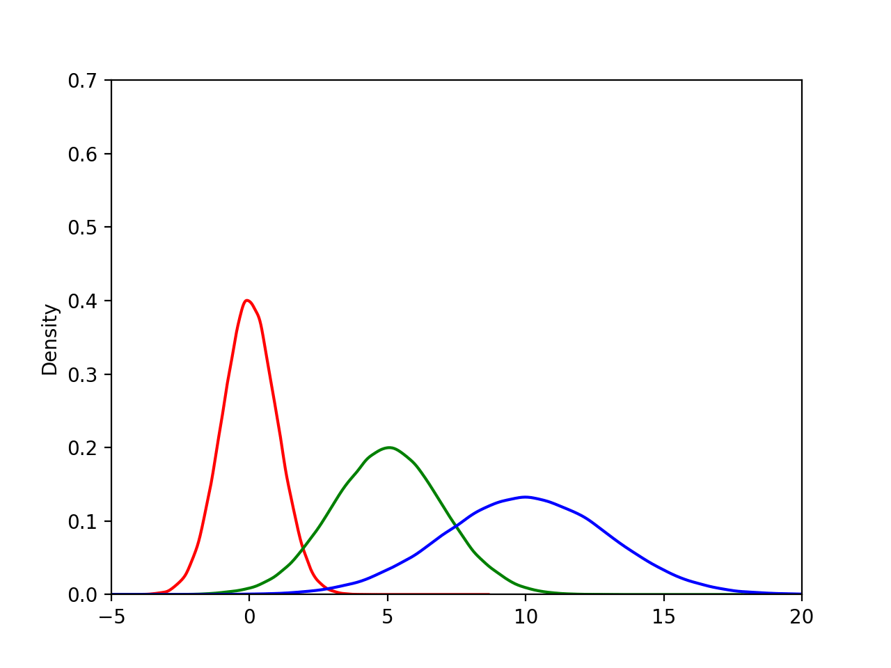
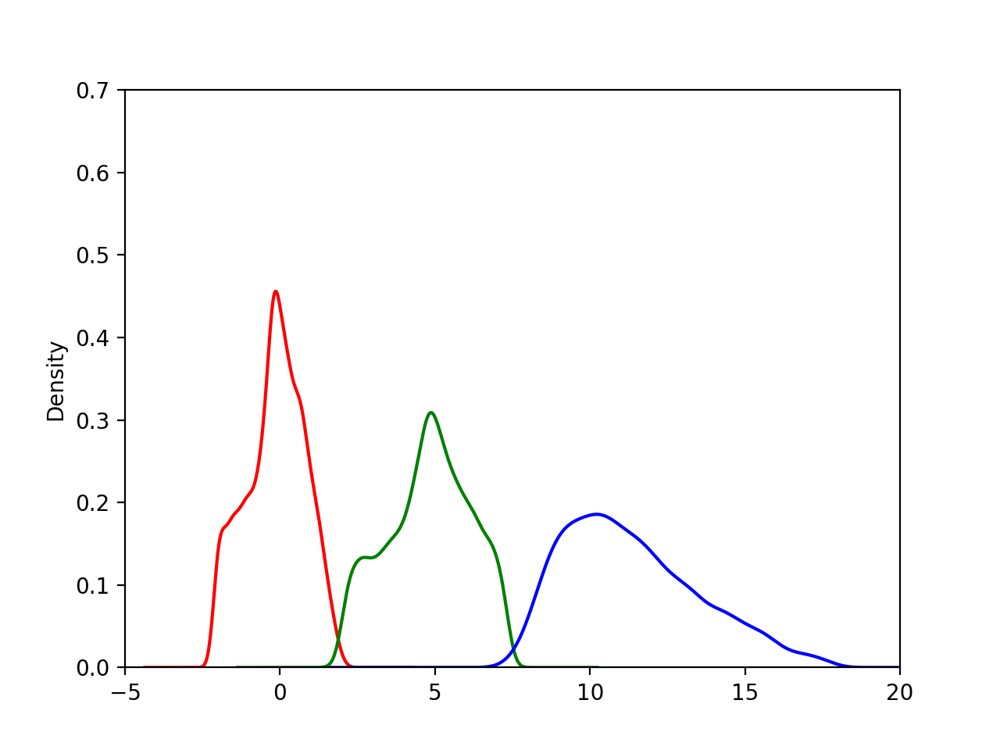

# TAC-GAN

This is the official pytorch implemention of the NeurIPS2019 paper [Twin Auxiliary Classifiers GAN](https://arxiv.org/abs/1907.02690) by Mingming Gong*, Yanwu Xu*, Chunyuan Li, Kun Zhang, and Kayhan Batmanghelich

  

Visualize the biased reconstruction of AC-GAN and our TAC-GAN correction to this as well as Projection-GAN.

| Original |  TAC | AC | Projection
:-------------------------:|:-------------------------:|:-------------------------:|:-------------------------:
  |   |   |  

## Experimemnts on real data
This implementation on cifar100 and Imagenet100 is based on [pytorch of BigGAN](https://github.com/ajbrock/BigGAN-PyTorch) implementation
To prepare for the env for running our code. cd the repository and run 'conda env create -f environment.yml'

### Overlap MNIST with '0' '1' and '0' '2'

  

### Cifar100 generation evaluation with Inception Score, FID and LPIPS, 32 resolution

  

### IMANGENET1000 generated images, 128 resolution

  

# To replicate our results of our NeuraIPS paper, do the follow:

## Simulation on MOG toy data

To run the 1-D and 2-D Mixture of Gaussian experiments, run the following steps and the results will be automatically saved in the MOG/'distance'_1D and MOG/'distance'_2D folder
1. cd MOG/
2. python 1-D_mix_gaussian.py
3. python 2-D_mix_gaussian.py

## Experiments on real data
For the real data experiments, the code is based on [pytorch BigGAN](https://github.com/ajbrock/BigGAN-PyTorch).

### Training data preparation

FIrstly, you need to transfer imagenet1000 image to HDF5 file, follow the command of [pytorch BigGAN](https://github.com/ajbrock/BigGAN-PyTorch) implementation

### Running on Cifar100

1. cd TAC-BigGAN
2. sh scripts/twin_ac_launch_cifar100_ema.sh

if you want to change the weight of auxiliary classifier, you can modify the '--AC_weight' arguments in 'twin_ac_launch_cifar100_ema.sh' script. The same for AC-GAN and Projection-GAN, change script to 'ac_launch_cifar100_ema.sh' and 'projection_launch_cifar100_ema.sh' respectively.

### Running on Imagenet1000
The steps are a little different from cifar100

1. cd TAC-BigGAN
2. sh twin_ac_launch_BigGAN_ch64_bs256x8.sh

if you want to change the weight of auxiliary classifier, you can modify the '--AC_weight' arguments in 'twin_ac_launch_BigGAN_ch64_bs256x8.sh' script. The same for AC-GAN and Projection-GAN, change script to 'ac_launch_BigGAN_ch64_bs256x8.sh' and 'projection_launch_BigGAN_ch64_bs256x8.sh' respectively.

